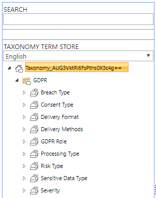

# GDPR Activity Hub - Customization

The GDPR Activity Hub is a sample starter kit solution that you can use to take inspiration from. However, you should consider that, in order to satisfy your real business requirements, you most likely will need to customize the solution. In this document you can find some useful information about how to apply the main customizations. 

## Taxonomy Customization
Most of the metadata available in the UI of the client-side web parts are customizable and are based on a SharePoint Online Term Group.
In fact, after installing the GDPR Activity Hub, in the Term Store Management of your SharePoint Online tenant, you will find the following Term Sets:
* Breach Type: defines the various flavors for a data breach incident. You can customize the terms of this term set.
* Consent Type: defines the various flavors of a consent. You can customize the terms of this term set.
* Delivery Format: defines the various delivery formats for a data export. You can customize the terms of this term set.
* Delivery Methods: defines the various delivery methods for a data export. You can customize the terms of this term set.
* GDPR Role: defines the roles of users, from a GDPR perspective. You should not customize this term set, unless you do not customize the solution code accordingly.
* Processing Type: defines the various processing types for a data processing event. You can customize the terms of this term set.
* Risk Type: defines the various risk types for an identity risk incident. You can customize the terms of this term set.
* Sensitive Data Type: defines the various kind of sensitive data. You can customize the terms of this term set.
* Severity: defines the severity levels (Low, Medium, High, Critical), of an event. You should not customize this term set, unless you do not customize the solution code accordingly.

In the following screenshot you can see the _"GDPR"_ Term Group, together with its Term Sets.



## Workflows Customization
In order to customize the workflow processes, you can create a Classic Team Site, apply the PnP provisioning templates that define the solution (files [GDPR-Activity-Hub-Information-Architecture-Full.xml](../Scripts/GDPR-Activity-Hub-Information-Architecture-Full.xml) and [GDPR-Activity-Hub-Workflows.xml](../Scripts/GDPR-Activity-Hub-Workflows.xml)) by using the following syntax:

```PowerShell
# Connect to the target site
Connect-PnPOnline <ClassicSiteUrl> -Credentials $Credentials

# Provision taxonomy items, fields, content types, and lists
Apply-PnPProvisioningTemplate -Path .\GDPR-Activity-Hub-Information-Architecture-Full.xml -Handlers Fields,ContentTypes,Lists,TermGroups

# Provision workflows
Apply-PnPProvisioningTemplate -Path .\GDPR-Activity-Hub-Workflows.xml -Handlers Workflows
```

Once you have done that, open SharePoint Designer, open the Classic Team Site and customize the workflows.
Upon completion of the customization, you can use the following PowerShell excerpt to export the new workflow definitions.

```PowerShell
# Connect to the source site
Connect-PnPOnline <ClassicSiteUrl> -Credentials $Credentials

# Export the updated workflows
Get-PnPProvisioningTemplate -Out .\GDPR-Activity-Hub-Workflows.xml -Handlers Workflows
```

## Data Provider Customization
At the time of this writing, the GDPR Activity Hub relies on SharePoint Online lists and libraries for storing data. However, from an architectural perspective you can change an abstraction layer and target any external DBMS. For example, you could use Microsoft SQL Azure Database to store many thousands of items.
If that is the case, you can simply define a new .ts file in the src\Components folder of this solution and implement the business logic to save data in the external DBMS.
Out of the box, the GDPR Activity Hub uses the _GDPRDataManager.ts_ file, which implements the concrete persistence layer for SharePoint Online by implementing the interface _IGDPRDataManager_. Any new custom data provider should implement the same interface.
Moreover, if you plan to use the Power BI report, you should replace the connection to the SharePoint Online site with a new connection that target the new DBMS.


