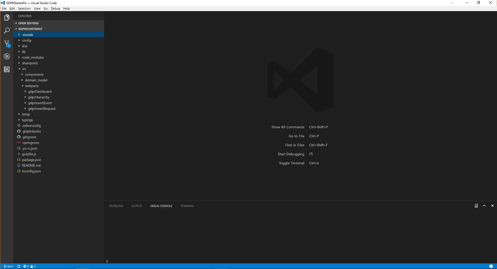
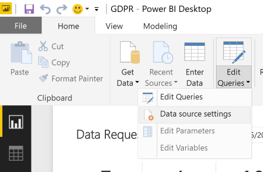
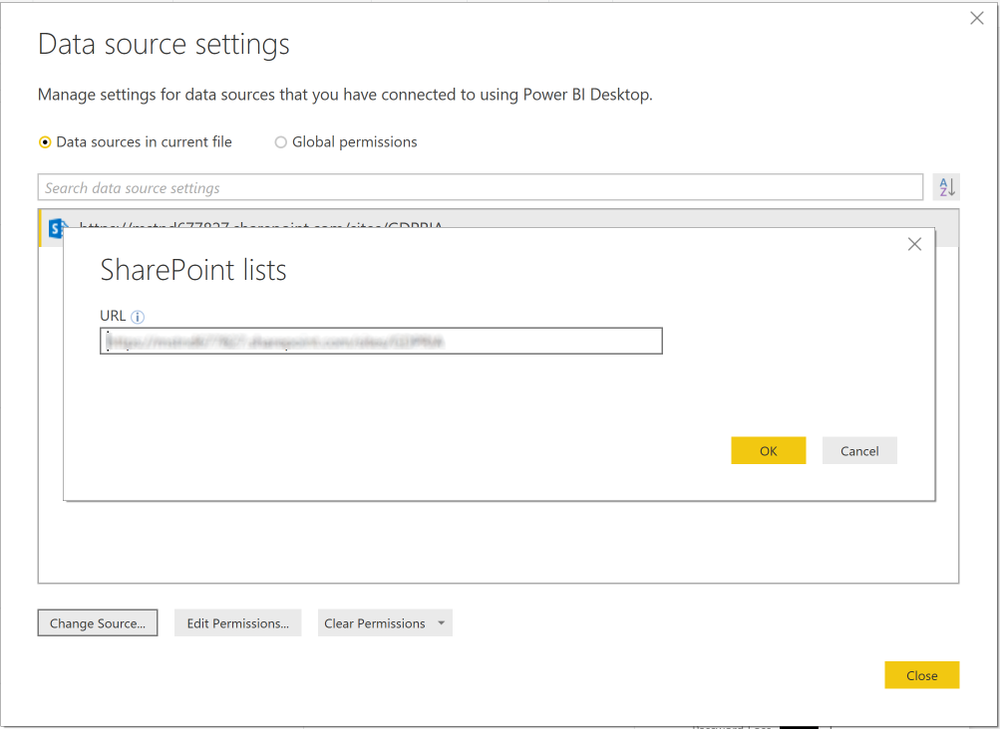

# GDPR Activity Hub - Setup Guide Using Office 365 CDN
In order to setup the GDPR Activity Hub, you have to accomplish few steps. Some of these steps are automatic, some of them are manual.
Please follow carefully the following guidance in order to succeed with the project installation.

## Create the Modern Site
First of all, you need to create a new Microsoft Office 365 Group, which includes a modern SharePoint Online Group site (GROUP#0).
Open your preferred web browser and go to the following URL:

```PowerShell
https://<your-tenant-name>.sharepoint.com/_layouts/15/sharepoint.aspx
```

Where the placeholder <your-tenant-name> needs to be replaced with the name of your Office 365 tenant.
Click on the "+ Create Site" command button in the upper left corner of the screen, in order to create a new SharePoint Online Modern Site.


Select to create a new "Team Site" by clicking on the icon on the left side of the "Create a Site" panel.
Provide a Name and a Description for the new site and press the "Next" button.

> It is up to you to select whether the Office 365 Group will be Public or Private.

If you like to invite other people to share the site, you can select them through the "Add group members" panel that follows in the site creation flow. Once you have selected any additional members or owners, click the "Finish" button.

The Office 365 Group, together with its Modern Site, will be created in a matter of few seconds. Copy and save the URL of the just created site, because you will use it pretty soon.

# Prepare the Development Environment
In order to install the GDPR Activity Hub, eventually customizing the solution and hosting it in your own Office 365 CDN, you will need a development machine ready to build SharePoint Framework (SPFx) solutions. You can find detailed and updated instructions about how to setup up an SPFx development machine in the document ["Set up your SharePoint client-side web part development environment"](https://dev.office.com/sharepoint/docs/spfx/set-up-your-development-environment)

Now, download the source code of the project either using [this repository](https://github.com/SharePoint/sp-dev-gdpr-activity-hub) and a GIT client, or simply by downloading [a ZIP file](https://github.com/SharePoint/sp-dev-gdpr-activity-hub/archive/master.zip) with the source code of the solution.

If you downloaded the ZIP file, please unzip it somewhere on your local file system.

In order to execute the PowerShell scripts needed to setup the solution, you have to install a couple of PowerShell extensions, which are listed below:
* PowerShell extensions for SharePoint Online, which are included in the ["SharePoint Online Management Shell"](https://www.microsoft.com/en-us/download/details.aspx?id=35588)
* PnP PowerShell extensions, which can be installed following the [instructions provided here](https://github.com/SharePoint/PnP-PowerShell#installation).

# Build the SharePoint Framework Solution
Once you have prepared your development environment, open a PowerShell console, and go to the folder where you downloaded and eventually unzipped the source code of the solution. Move to the sub-folder named _GDPRStarterKit_ and execute the following command:

```PowerShell
Code .
```

It will start Visual Studio Code, opening the GDPR solution.



To host the SPFx assets on the Microsoft Office 365 CDN, follow these steps:
* Choose a name for a SharePoint Online site collection - which will be created in the next step - and for a document library, within that site, and write them down in a safe place. Usually a good name for such a site is **"CDN"** and a meaningful name for the document library is **"CDNFiles"**. The overall base URL of your CDN will be something like: 

```PowerShell
https://publiccdn.sharepointonline.com/<your-tenant-name>.sharepoint.com/sites/<your-CDN-site-name>/<document-library-name>/
```

* Open the _write-manifest.json_ file that is available under the _config_ folder of the solution and replace the **cdnBasePath** property with the value of your public CDN URL, followed by the name of the project (which is **GDPRActivityHub**). The overall URL will be something like:

```PowerShell
https://publiccdn.sharepointonline.com/<your-tenant-name>.sharepoint.com/sites/<your-CDN-site-name>/<document-library-name>/GDPRActivityHub
```

In the following Figure you can see the _write-manifest.json_ file in the UI of Visual Studio Code.


* Save the _write-manifest.json_ file and go back to the PowerShell console, which should still be located under the solution's folder

* From within the console, execute the following commands in order to install the dependencies and generating the bundle:

```PowerShell
npm install
gulp bundle --ship
gulp package-solution --ship
```

* By default the gulp tool will prepare the bundled files under the folder _temp/deploy_ of your solution. Copy the full path of that folder, because you will use it in the following section.

> You can find further details about hosting your SPFx solutions with Microsoft Office 365 CDN in the document ["Hosting client-side web part from Office 365 CDN"](https://dev.office.com/sharepoint/docs/spfx/web-parts/get-started/hosting-webpart-from-office-365-cdn).

# Provision Artifacts
From within the previously opened PowerShell console, go to the folder where you downloaded and eventually unzipped the source code of the solution, and move to the _Scripts_ sub-folder of the solution.

Now, you can execute the following PowerShell command:

```PowerShell
.\Provision-GDPRActivityHub.ps1 -GroupSiteUrl "https://<your-tenant-name>.sharepoint.com/sites/<your-group-site-URL>" `
                                -Credentials $credentials `
                                -ConfigureCDN  `
                                -CDNSiteName "CDN"  `
                                -CDNLibraryName "CDNFiles"  `
                                -SPFxAssetsPath <path-of-assets>
```

The PowerShell script requires some input arguments, which are:
* **GroupSiteUrl**: the URL of the Modern Site that you created before.
* **Credentials**: the credentials of a tenant administrator, which will be used to setup the solution. If you don't provide this argument, the script will prompt you for credentials during execution.
* **ConfigureCDN**: an optional switch to instruct the script to create and configure an Office 365 CDN that will host the SPFx client-side web parts.
* **CDNSiteName**: the relative URL of a SharePoint site collection that will be create to host the CDN files, if you select to create and configure the Office 365 CDN.
* **CDNLibraryName**: the name of the document library that will be created to host the CDN files.
* **SPFxAssetsPath**: the file system path of the folder where your SPFx client-side web parts assets are stored. Usually it is the _temp/deploy_ subfolder of your SFPx solution.

> Notice that you can skip the configuration of the CDN in Microsoft Office 365, and you can instead use whatever else hosting solution of your choice.

# Upload the SPFx package
You are now ready to upload the SPFx solution package to SharePoint Online. In order to do that, follow these steps:

* Open the _App Catalog_ site for your tenant. If you don't have one or if you don't know the URL of your _App Catalog_ site, please follow the instructions illustrated in the document ["Use the App Catalog to make custom business apps available for your SharePoint Online environment"](https://support.office.com/en-us/article/Use-the-App-Catalog-to-make-custom-business-apps-available-for-your-SharePoint-Online-environment-0b6ab336-8b83-423f-a06b-bcc52861cba0?ui=en-US&rs=en-US&ad=US) to create a new _App Catalog_ site.
* Go to the "Apps for SharePoint" library of the  _App Catalog_ and upload the file named _gdpr-starter-kit.sppkg_ that you can find under the _sharepoint/solution_ sub-folder of the main solution folder.
* Accept to trust and deploy the solution in your tenant by pressing the **Deploy** button in the following popup dialog.


# Add App and Create Modern Pages
Now browse to the Modern Site that you created before, Add an App by clicking the New -> App menu item highligthed in the following Figure.


In the left quick launch menu select the _From Your Organization_ menu item and select to install the app called _gdpr-starter-kit-client-side-solution_ as depicted in the following Figure.


Now go back to the home page of the site, and create four Modern Pages, by selecting the option New -> Page in the upper left menu, as like as you can see in the following Figure.


The pages to create should be:
* Insert Event/Incident: in this page you should add the client-side web part named "GDPR Insert Event". Configure the client-side web part in order to target the _Events_ list.
* Insert Request: in this page you should add the client-side web part named "GDPR Insert Request". Configure the client-side web part in order to target the _Requests_ list.
* GDPR Hierarchy: in this page you should add the client-side web part named "GDPR Hierarchy". Configure the client-side web part in order to target the _Hierarchy_ list.
* Dashboard of Tasks: in this page you should add the client-side web part named "GDPR Dashboard". Configure the client-side web part in order to target the _Tasks_ list.

In the following Figure you can see the SPFx client-side web parts defined in the GDPR Activity Hub project and available for insertion in your environment.


Go back to the home page of the site, edit the home page and remove all of the already existing client-side web parts. Add a "Power BI" client-side web part, in the next section you will configure it.

# Upload and Configuration of the Power BI dashboard

In order to install the GDPR Activity Hub dashboard based on Power BI, you need to have at least a FREE license of Power BI. Thus [download and install the Power BI desktop client](https://powerbi.microsoft.com/en-us/desktop/).

Once the Power BI Desktop client is installed, run it and open the _GDPR.pbix_ file that is located under the _Scripts_ folder of the solution that you downloaded from GitHub or from the path where you unzipped the solution.

Open the _"Home"_ ribbon, select the _"Edit Queries"_ command and click on the _"Data Source settings"_ menu item.



Now add a new data connection, targeting your Modern Site and provide a set of valid credentials to access the content of the site.



Close the windows and select _"Publish"_ command on the _"Home"_ ribbon. Follow the instructions to publish the PBIX file on Power BI. Once the report has been published, save the URL on Power BI.

Now, go back to the home page of the site and configure the Power BI client-side web part to target the URL of the report that you published in the previous section.

Save and Publish the new home page and you are done!

# Play with the Solution
Now you are ready to play with the solution. You can find a detailed help in the ["How to Use the GDPR Activity Hub"](./Documentation/How-To-Use-GDPR-Activity-Hub.md) document.


