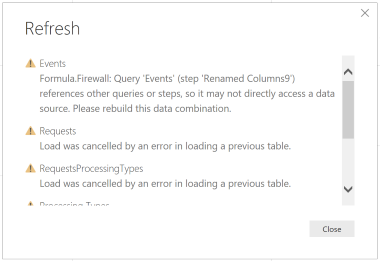
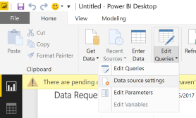
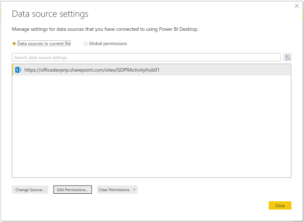
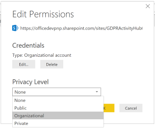

# GDPR Activity Hub - Troubleshooting Guide
While installing or using the GDPR Activity Hub there could be some unexpected issues. In this page we are collecting the known ones, together with suggested workarounds.

## Power BI - Privacy Settings
In case you will experience the issue highlighted in the following Figure, while refreshing data in the Power BI dashboard, please follow the instructions below to fix it.

First of all, go to the _"Home"_ ribbon and expand the _"Edit Queries"_ ribbon command, in order to select the _"Data Source Settings"_ command, as it is illustrated in the following Figure.

Now, select the data source and click the _"Edit Permissions"_ button in the lower part of the screen. See the following Figure.

In the _"Edit Permissions"_ popup dialog that will show up, select a value of _"Organizational"_ for the _"Privacy Level"_ option, as depicted in the following Figure.

Save and close all of the windows and refresh your data.

## Power BI - Sometimes it fails while refreshing data
In order to load the dashboard, you should have a full set of data in the target data source site. We plan to add a bunch of fake items in the target lists (Events and Requests) during the PowerShell setup phase. Right now, it is better to load some real or sample data in the GDPR Activity Hub portal before configuring the Power BI dashboard.

