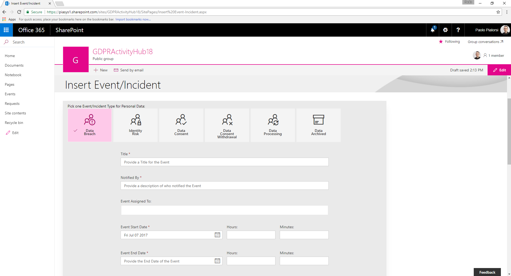
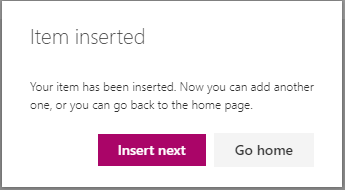
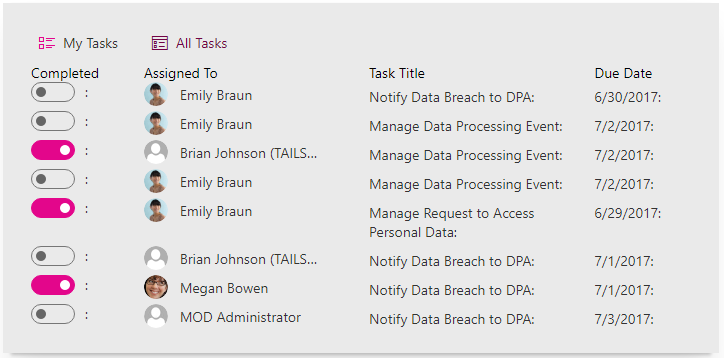
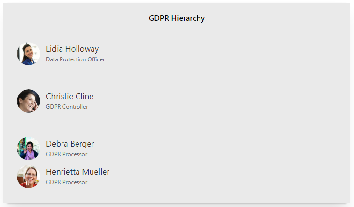

# GDPR Activity Hub - User Guide
In this document you can learn about the main capabilities of the GDPR Activity Hub project.
The main functionalities of the project are:
* Home Page and Dashboard
* Tracking of events and incidents
* Tracking of requests
* Tasks assignment and management for GDPR processes
* Hierarchy of GDPR roles in the company

In the following sections you will learn about each of these items.

## Home Page and Dashboard
The main entry point of the solution is the home page of the Modern Site that hosts the data. In the following Figure you can see the dashboard (built using Power BI) that allows you to measure and monitor your performance, related to the main GDPR requests and events.

The dashboard gets updated based on a schedule and loads data stored in the current Modern Site and manually loaded by you, or your end users, by leveraging the client-side web parts of this solution.

> Depending on the license of Power BI you can have more or less automated update slots during a work day. For example, in the FREE edition of the product, you can have up to 8 refresh per day. However, if you buy a commercial license of Power BI, you can have more.

## Tracking of Events and Incidents
You can keep track of events and incidents, using a dedicated list of _Events_ and a client-side web part to add new items.
In the followig Figure you can see the UI of the "GDPR Insert Event" client-side web part.

There are six flavors of events that you can keep track of:
* Data Breach: it is an incident that happens whenever there is a Data Breach in your environment. You should file a new item and notify DPA within 72 hours. That's why the project includes a workflow that assigns a reminder task for DPA notification targeting the assignee of the Data Breach event.
* Identity Risk: it is an incident that happens whenever there is an Identity Risk (even potential) in your environment.
* Data Consent: it is an event that happens whenever a Data Subject gives you the consent to handle her/his data.
* Data Consent Withdrawal: it is an event that happens whenever a Data Subject withdraws a consent to handle her/his data.
* Data Processing: it is an event that happens whenever a Data Processing activity happens, involving one or more personal data items.
* Data Archived: it is an event that happens when one or more personal data item are archived for recording purposes.

You simply need to select the kind of event that you want to file, and the UI will adapt the form fields accordingly, as well as the validation rules.

Once you have properly filled out the form, accordingly to the validation rules in place, the _Save_ button will become enabled and by pressing it a new item will be stored in the _Events_ list in your SharePoint Online Modern Site. After saving a new item, the client-side web part will notify you with a message like the one depicted in the following Figure.

If you press the _"Insert next"_ button the client-side web part will allow you to add another item, and it will keep all of the fields pre-filled with previously inserted values, to speed up the insertion of a stream of data. On the contrary, if you press the _"Go home"_ button, the client-side web part will redirect you to the home page of the Modern Site.

## Tracking of Requests from Data Subjects
As like as it happens with the list of _Events_, you can also keep track of _Requests_, which target the corresponding custom list in the GDPR Activity Hub Modern Site.
In the followig Figure you can see the UI of the "GDPR Insert Request" client-side web part.

There are five flavors of requests that you can keep track of:
* Data Access: allows to keep track of a request to access personal data of a Data Subject.
* Data Correct: allows to keep track of a request to correct personal data of a Data Subject.
* Data Export: allows to keep track of a request to export personal data of a Data Subject.
* Data Objection: allows to keep track of an objection to access personal data of a Data Subject.
* Data Erase: allows to keep track of a request to erase personal data of a Data Subject.

From a UI perspective, this web part behaves exactly like the one to store a new event or incident.

## Tasks Assignment and Management for GDPR Processes
When some kind of events or requests are inserted into the GDPR Activity Hub, there a three sample workflows that can be triggered. The available sample workflows are:
* Data Breach Management: assigns a task to the assignee of the data breach event, in order to remind the notification to DPA within 72 hours after the happening of the Data Breach.
* External Data Processing: assigns a tasks to the assignee of the event, just to remind her/him to manage the data processing.
* Request to Access Personal Data Management: assigns a task to the assignee of the request, so that she/he can keep track of his tasks list.

The GDPR Activity Hub provides also a client-side web part to monitor the assigned tasks for the current user, or for all the users (if the current user is an admin of the Modern Site). 

As you can see from the UI, it is also possible to easily mark a task as completed, just by clicking on the toggle button beside every single task item.

## Hierarchy of GDPR Roles in the Company
Another useful feature of the GDPR Activity Hub is the GDPR Hierarchy. In fact, there is a custom list called _Hierarchy_ that you can use to store information about people involved in managing GDPR requirements, and you can assign roles to them. The supported roles are:
* Data Protection Officer
* GDPR Controller
* GDPR Processor

In the following Figure you can see a sample hierarchy, presented by the GDPR Hierarchy client-side web part.

## Limitations of the Solution
The GDPR Activity Hub is a sample starter kit solution that you can use to take inspiration from. However, you should consider that it is not a "ready to go" full product, and most likely you will need to customize it, in order to adhere to your real business requirements. For further information about how to customize the GDPR Activity Hub, you can read the [Customization Guide](./Customization.md).

Here are highlighted some well-known limitations:
* Because the GDPR Activity Hub uses SharePoint Online lists to store data about requests and events, you should keep in mind the limits of SharePoint Online in terms of maximum number of items in a list.
* The home page dashboard is built on top of Microsoft Power BI, which can be leveraged in its FREE version, as well. However, with the FREE version of Power BI you are limited to a maximum of 1GB of data per user, and you cannot have collaboration on reports by multiple users.
* The workflows processes are just for the sake of making examples, and most likely you will need to extend or customize them in order to target your real business goals. The workflows have been defined using Workflow Manager and SharePoint Designer, in order to being able to apply them on the fly on any target site where you install the GDPR Activity Hub. However, the GDPR Activity Hub targets Modern Sites, where you cannot use SharePoint Designer. Thus, in order to edit or customize a workflow you should work on a Classic Team Site, then export the workflow definitions using the PnP Provisioning Engine and import them in the target Modern Site, still using the PnP Provisioning Engine.

