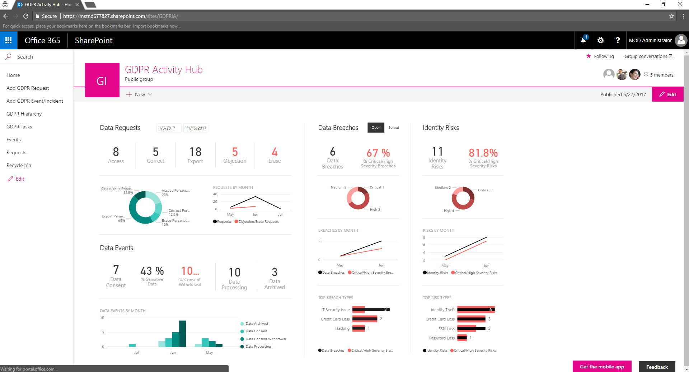

# GDPR Activity Hub (July 2017)
This is the repository for the GDPR Activity Hub project.

The GDPR Activity Hub is an open source project that you can consider as a starter kit for building a management hub for EU GDPR
(European Global Data Protection Regulation). The goal of this project is to give customers and partners something to start with
and to play with in order to keep track of all the fundamental events, requests, tasks and activities required to be compliant with
the GDPR.

Furthermore, one fundamental goal of this project is to show how to use the latest Microsoft technologies (like the SharePoint Framework, Office UI Fabric, Office 365 Developer Patterns and Practices, etc.) to easily build real-life solutions.

## Main Components
The solution targets Microsoft Office 365 and it is founded on Microsoft SharePoint Online.
The main components of the solution are a SharePoint Online Modern Site (i.e. an Office 365 Group Site), some custom developed
SharePoint Framework client-side web parts, a few sample workflows built using Workflow Manager for SharePoint Online, and a Power BI
dashboard. Moreover, there are some PowerShell script files that you can use to speed up the setup process of the solution in your own Office 365 tenants.

## User Guide
Please, refer to the [User Guide](./Documentation/User-Guide.md) document to understand what you can do with the GDPR Activity Hub.

## Target Audience
The target audience for this project are Microsoft Partners and customers with an internal IT development team, which can install and customize the sample solution based on the real customer's needs. If you are an end-user company, you should ask a Microsoft Partner for support to customize, install, and use this solution.

## Setup
In order to setup the solution, you can follow the instructions provided in the [Setup Guide](./Documentation/Setup-Guide.md) document.

## Architecture
Out of the box, the solution uses SharePoint Online to host the UI components, as well as to store data about events, requests, tasks and activities required by GDPR. However, you should keep in mind that SharePoint is not a replacement for a relational DBMS. Thus, you can use or consider to use this solution for small or eventually medium businesses, but you cannot use the solution "as is" for big enterprises or companies with many thousands of items to keep track of.
Nevertheless, the architecture of the solution has been defined with a clear decoupling between the UI and the data persistence storage, so that you can eventually customize the solution (because it is an open source project) and replace the SharePoint Online persistence layer with a DBMS based storage system. The same approach can be used to connect the Power BI dashboard with a DBMS instead of using SharePoint Online as the main data source.

## Resources

* [European Global Data Protection Regulation (GDPR)](https://en.wikipedia.org/wiki/General_Data_Protection_Regulation)
* [SharePoint Framework](https://dev.office.com/sharepoint/docs/spfx/sharepoint-framework-overview)
* [Power BI](https://powerbi.microsoft.com/en-us/)

## Disclaimer
This GDPR Activity Hub is intended to assist organizations with their GDPR compliance progress. This GDPR Activity Hub should not be relied upon to determine how GDPR applies to an organization or an organization’s compliance with GDPR. This GDPR Activity Hub does not constitute legal advice, nor does it provide any certifications or guarantees regarding GDPR compliance. Instead, we hope the GDPR Activity Hub identifies steps that organizations can implement to simplify their GDPR compliance efforts. The application of GDPR is highly fact-specific. We encourage all organizations using this GDPR Activity Hub to work with a legally qualified professional to discuss GDPR, how it applies specifically to their organization, and how best to ensure compliance.

MICROSOFT MAKES NO WARRANTIES, EXPRESS, IMPLIED, OR STATUTORY, AS TO THE INFORMATION IN THIS GDPR Activity Hub. Microsoft disclaims any conditions, express or implied, or other terms that use of the Microsoft products or services will ensure the organization’s compliance with the GDPR. This GDPR Activity Hub is provided “as-is.” Information and recommendations expressed in this GDPR Activity Hub may change without notice.

This GDPR Activity Hub does not provide the user with any legal rights to any intellectual property in any Microsoft product or service.  Organizations may use this GDPR Activity Hub for internal, reference purposes only.

© 2017 Microsoft. All rights reserved.

